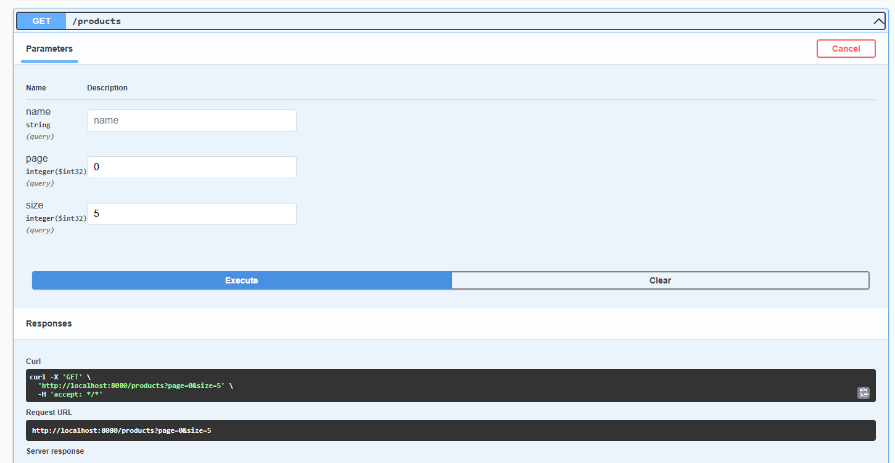

# CRUD de Produtos - Desafio Técnico
Projeto desenvolvido como parte de um desafio técnico para estágio. O projeto consiste em uma API RESTful CRUD de produtos completo, utilizando Spring Boot, banco em memória H2 e documentação com Swagger UI.

## Tecnologias Utilizadas
- Java 21
- Spring Boot 3.5.0
- Spring Data JPA
- Lombok
- H2 Database
- Swagger UI (OpenAPI)
- Postman (para testes manuais)
- MockMvc (para testes automatizados)

## Funcionalidades

| Método | Endpoint           | Descrição                                                    |
|--------|--------------------|--------------------------------------------------------------|
| POST   | `/products`        | Criar um novo produto                                        |
| GET    | `/products/{id}`   | Buscar produto por ID                                        |
| GET    | `/products`        | Listar produtos (com filtro por nome e paginação)            |
| PUT    | `/products/{id}`   | Atualizar um produto existente                               |
| DELETE | `/products/{id}`   | Remoção lógica (define `active = false` ao invés de deletar) |

## Exemplo de requisição POST
```json
{
  "name": "TV",
  "description": "Televisão 40 polegadas",
  "price": 1300.00,
  "quantityStock": 3,
  "category": "ELECTRONICS",
  "active": true
}
```
## Acessar
Swagger UI: http://localhost:8080/swagger-ui/index.html
H2 Console: http://localhost:8080/h2-console
JDBC URL: jdbc:h2:mem:testdb
Usuário: sa
Senha: (deixe em branco)

## Testes
Testes manuais via Postman
Foram realizados testes de todos os endpoints usando o Postman.


Swagger UI


Teste unitário com MockMVC

